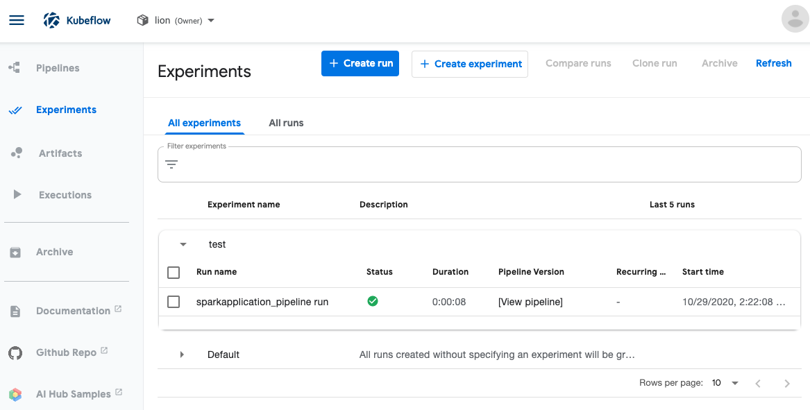
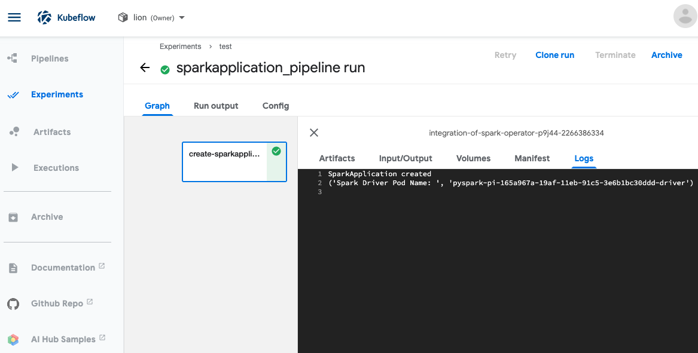
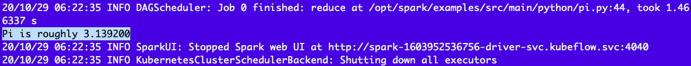

# Integration of kubeflow pipeline and spark-operator
This repository is a kubeflow pipeline component that could be used to work with spark-operator in the same k8s cluster.
We'll show you how to use this kubeflow pipeline component with spark-operator.

Spark-operator is a little different from native Spark on k8s. We don't need a k8s://http connectivity to connect to spark master, instead we need to create a SparkApplication which is a CRD(Custom Resource Definition) in k8s. In this way, our spark program is unware of spark configuration while spark-operator could find our SparkApplications automatically.

In this tutorial, we tried to execute a spark official example which calculates Pi.

Note: check your spark version in spark-operator. Our test runs on Spark 2.4.5.

Now follow the steps to enjoy running kubeflow pipeline with spark-operator.

## Build the Docker image for our kubeflow pipeline component

Build the docker image for our pipeline component then upload it to your docker image registry.

```
cd pipeline-components/create-sparkapplication/container
docker build -t <Your Docker Registry>/kfp-create-sparkapplication:<tag> .
docker push <Your Docker Registry>/kfp-create-sparkapplication:<tag>
```

In [component.yaml](./pipeline-components/create-sparkapplication/component.yaml), change the docker image to the one you just built.

## Test the kubeflow pipeline component
1. Upload [kubeflow-pipeline-create-SparkApplication.ipynb](./pipeline-components/create-sparkapplication/kubeflow-pipeline-create-SparkApplication.ipynb) and [component.yaml](./pipeline-components/create-sparkapplication/component.yaml) to your kubeflow noteobook server.

2. Run the notebook, then a kubeflow pipeline defined in the notebook will be generated.
This pipeline uses our pipeline component to create a SparkApplication in our k8s cluster, so that spark-operator will automatically catch our spark job and execute.

1. From kubeflow pipeline UI, we could find the generated pipeline there.



Let's look into the pipeline component logs.



Our program tell us that the spark driver pod is pyspark-pi-165a967a-19af-11eb-91c5-3e6b1bc30ddd-driver.
Now let's check the results of the spark job.
```
kubectl logs pyspark-pi-165a967a-19af-11eb-91c5-3e6b1bc30ddd-driver -n kubeflow
```

